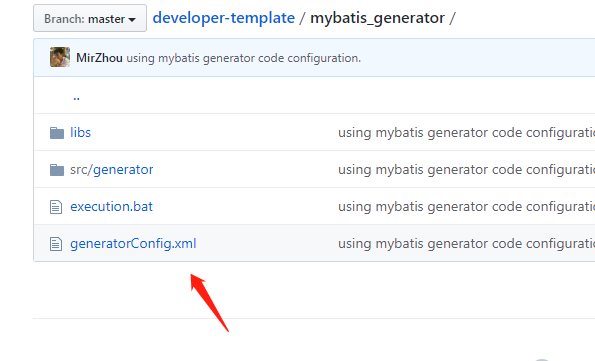
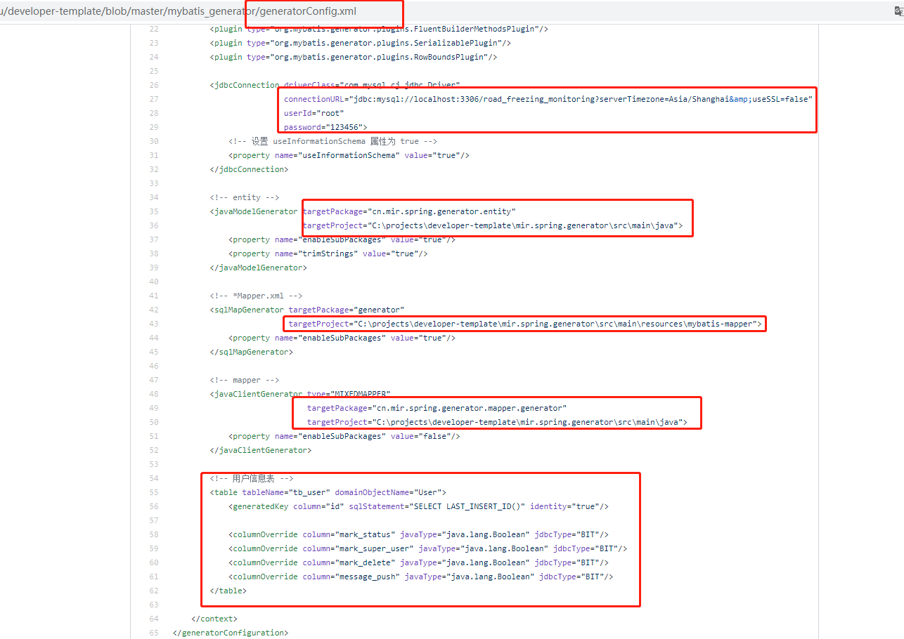
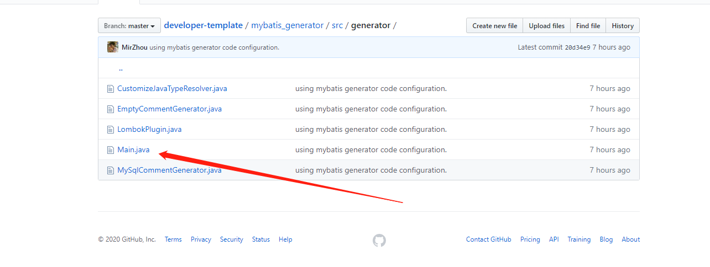
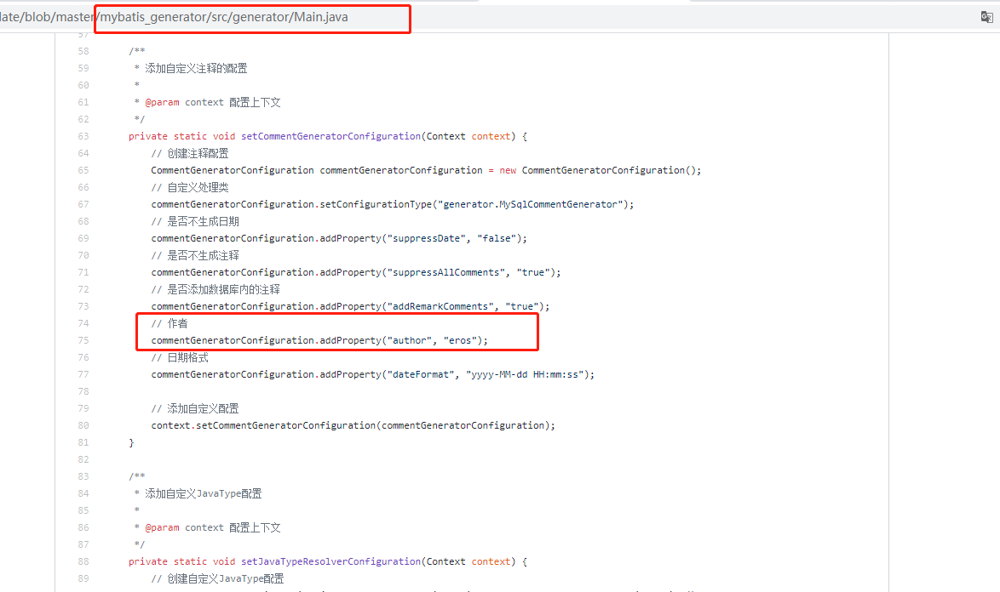
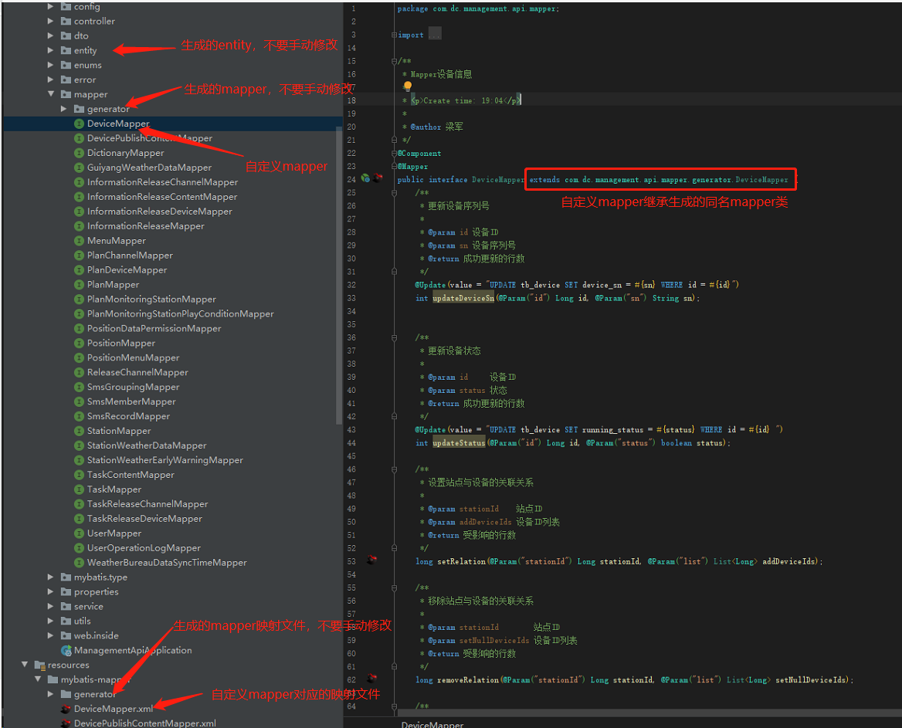
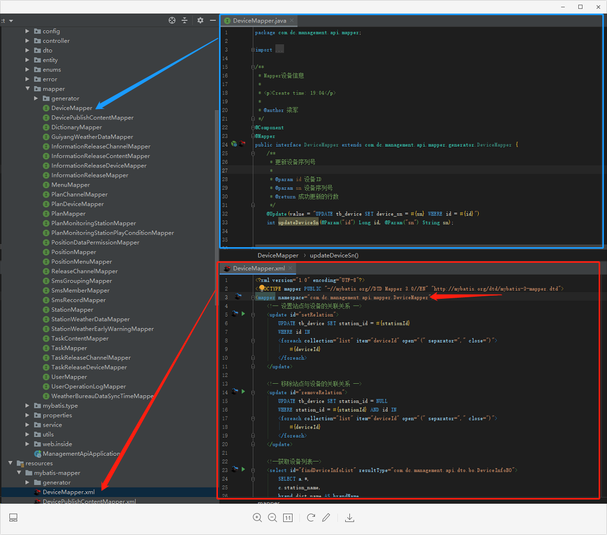

# 代码生成使用说明

1. 修改`generatorConfig.xml`文件配置

   - 数据库配置：

     > `jdbcConnection.connectionURL`

   - entity 实体:

     > 包名：`javaModelGenerator.targetPackage`  
     > 文件绝对路径（不包含包名）：`javaModelGenerator.targetProject`

   - \*Mapper.xml：

     > 包名：`sqlMapGenerator.targetPackage`  
     > 文件绝对路径（不包含包名）：`sqlMapGenerator.targetProject`

   - Mapper 类
     > 包名：`javaClientGenerator.targetPackage`  
     > 文件绝对路径（不包含包名）：`javaClientGenerator.targetProject`




2. 修改`src/generator/Main.java`配置

   - 创建人修改：

   ```
   // 作者
   commentGeneratorConfiguration.addProperty("author", "eros");
   ```




3. 执行`execution.bat`生成代码

4. 代码示例如下图



5. 注意事项

- 注：请勿手动修改自动生成代码，防止重新生成时，代码被覆盖。可使用继承来实现自定义代码。如下图，相同颜色与方框指向的文件与代码。


